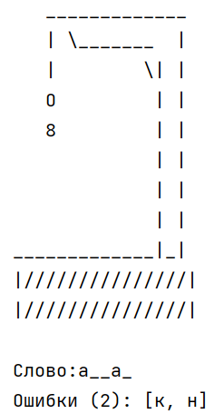
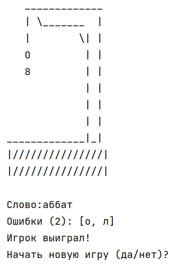
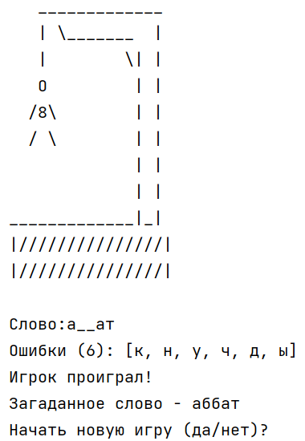

# Hangman Game 
Hangman - это классическая игра, в которой игрок должен угадать слово, выбирая буквы. Если игрок угадывает букву, она отображается в слове. Если буква неправильная, на виселице появляется часть тела. Если игрок не угадывает слово до того, как виселица будет полностью нарисована, он проигрывает.

Это первый проект из Java Роадмап Сергея Жукова https://zhukovsd.github.io/java-backend-learning-course/

---
## Описание игры 
- Программа считывает слова из файла **Dictionary.txt** и выбирает случайное слово для угадывания.
- Игрок вводит буквы, чтобы угадать слово.
- Если буква есть в слове, она отображается на своих позициях.
- Если буквы нет в слове, на виселице добавляется часть тела (голова, туловище, руки, ноги).
- Игрок выигрывает, если угадывает слово до того, как виселица будет полностью нарисована.
- Игрок проигрывает, если виселица будет нарисована полностью (6 неправильных попыток).
---
## Скриншоты

### старт игры

### Игровой процесс

### Победа

### Поражение

---
## Инструкии
1. Скачайте репозиторий 
git clone https://github.com/PetrovYegor/Hangman.git
2. Скомпилируйте и запустите проект
---
## Как играть
1. При запуске программы вам будет предложено начать игру. Введите **да**, чтобы начать, или **нет**, чтобы выйти.
2. Программа выберет случайное слово из файла **Dictionary.txt**.
3. Вводите буквы по одной, чтобы укадать слово.
4. Если буква есть в слове, она отобразится на своих позициях.
5. Если буквы нет в слове, на виселице появится часть тела.
6. Игра продолжается до тех пор, пока вы не угадаете слово или не проиграете